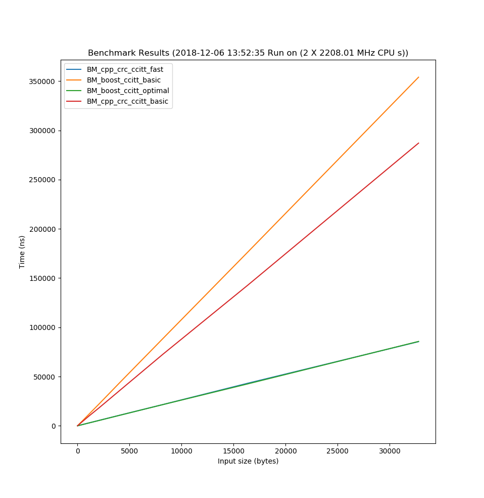
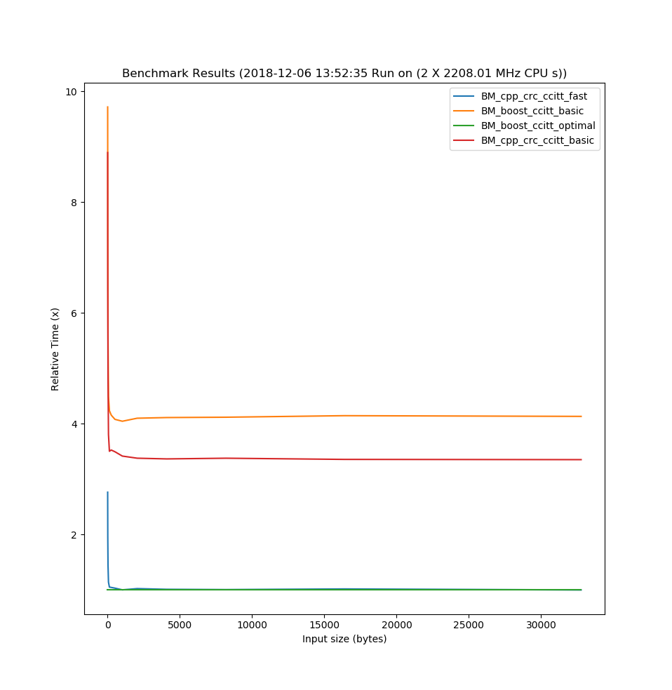

# crc-bench [](https://travis-ci.com/lokraszewski/crc-bench)
Benchmarking the following crc engines:
* [lokraszewski/cpp-crc](https://github.com/lokraszewski/cpp-crc)
* [boost crc](https://www.boost.org/doc/libs/1_64_0/libs/crc/)

## Results
### Library Comparison

The benchmark was ran on the following configuration:
```
VM Ubuntu 64-bit - 8GB - 2 Cores Enabled
Intel(R) Core(TM) i7-8750H CPU @ 2.20GHz
Base speed: 2.20 GHz
Sockets:    1
Cores:  6
Logical processors: 12
Virtualisation: Enabled
L1 cache:   384 KB
L2 cache:   1.5 MB
L3 cache:   9.0 MB
```
The fastest crc in the benchmark is the [boost crc](https://www.boost.org/doc/libs/1_64_0/libs/crc/) using crc_optimal. 

We may plot the relative performance of other algorithms with the following results:


## Acknowledgments
* [lakshayg/google_benchmark_plot](https://github.com/lakshayg/google_benchmark_plot) - Python script to plot google benchmark results. 
